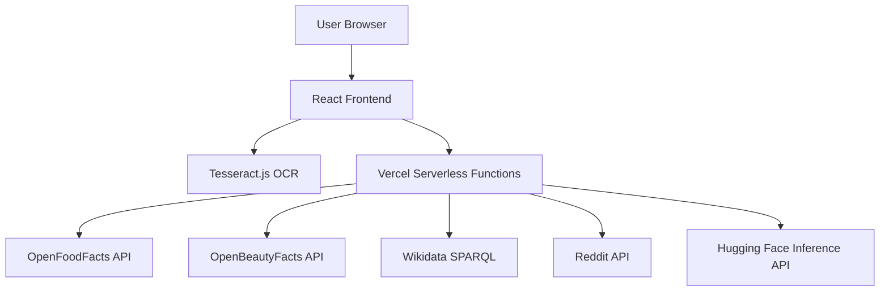

# Scan It Know It - Architecture

## Overview

This application follows a client-server architecture where the frontend runs in the browser and communicates with serverless functions deployed on Vercel.

## Architecture Diagram

## Component Details

### 1. React Frontend

- **Location**: `/src`
- **Framework**: React with TypeScript
- **Styling**: Tailwind CSS
- **OCR**: Tesseract.js (client-side)
- **State Management**: React hooks

### 2. Vercel Serverless Functions

- **Location**: `/api`
- **Runtime**: Node.js
- **Deployment**: Automatic with Vercel

#### API Endpoints

| Endpoint | Method | Description |
|----------|--------|-------------|
| `/api/identify` | POST | Identifies product from OCR text |
| `/api/ingredients` | POST | Fetches ingredients for a product |
| `/api/nutrition` | GET | Fetches nutrition information |
| `/api/reddit` | GET | Fetches community reviews |
| `/api/qa` | POST | Provides AI-powered Q&A |

### 3. Free/Open-Source APIs

#### Product Data APIs

- **OpenFoodFacts**: Food product data
- **OpenBeautyFacts**: Cosmetic product data
- **Wikidata**: General product information

#### Community APIs

- **Reddit**: User reviews and discussions

#### AI APIs

- **Hugging Face Inference**: Free tier for AI models

## Data Flow

1. User captures/upload image
2. Tesseract.js performs OCR in browser
3. OCR text sent to `/api/identify`
4. Product identified and summary generated
5. User expands cards to fetch additional data:
   - Ingredients from `/api/ingredients`
   - Nutrition from `/api/nutrition`
   - Reviews from `/api/reddit`
   - Q&A from `/api/qa`
6. Data displayed in animated cards

## Deployment

- **Frontend**: Static files served by Vercel
- **Backend**: Serverless functions automatically scaled
- **No databases**: All data fetched from external APIs
- **No proprietary services**: All free/open-source

## Benefits

- **No server costs**: Serverless functions only run when needed
- **Free APIs**: No ongoing costs for data services
- **Scalable**: Automatically scales with usage
- **Global CDN**: Fast worldwide access
- **Easy deployment**: One-click deploy to Vercel