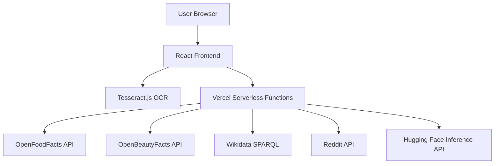

# Scan It Know It - Application Architecture and File Structure

## Overview

This application follows a client-server architecture where the frontend runs in the browser and communicates with serverless functions deployed on Vercel.

## Architecture Diagram



## Component Details

### 1. React Frontend

- **Location**: `/src`
- **Framework**: React with JavaScript
- **Styling**: Tailwind CSS
- **OCR**: Tesseract.js (client-side)
- **State Management**: React hooks

### 2. Vercel Serverless Functions

- **Location**: `/api`
- **Runtime**: Node.js
- **Deployment**: Automatic with Vercel

#### API Endpoints

| Endpoint | Method | Description |
|----------|--------|-------------|
| `/api/analyze` | POST | Analyzes uploaded image for QR codes, text, objects, and captions |

### 3. Free/Open-Source APIs

#### Product Data APIs

- **OpenFoodFacts**: Food product data
- **OpenBeautyFacts**: Cosmetic product data
- **Wikidata**: General product information

#### Community APIs

- **Reddit**: User reviews and discussions

#### AI APIs

- **Hugging Face Inference**: Free tier for AI models

## File Structure

```
project-root/
├── app/                      # Main application
│   ├── src/                 # Frontend source code
│   │   ├── components/      # React components
│   │   │   ├── CameraPanel.jsx
│   │   │   ├── AnalysisPanel.jsx
│   │   │   └── App.jsx
│   │   └── main.jsx         # Entry point
│   ├── api/                 # API endpoints
│   │   └── analyze.js       # Main analysis endpoint
│   ├── dist/                # Built assets (generated)
│   ├── vite.config.js       # Vite configuration
│   ├── vercel.json          # Vercel configuration
│   ├── package.json         # Dependencies and scripts
│   └── .env                 # Environment variables
├── scanitknowit-backend/    # Backend server (separate deployment)
│   ├── server.js            # Main server file
│   ├── .env.production      # Production environment variables
│   └── render.yaml          # Render deployment configuration
├── DEPLOYMENT.md            # Deployment process and checklist
├── README.md                # This file (Application architecture and file structure)
└── ERRORS_AND_FIXES.md      # Errors and fixes documentation
```

## Data Flow

1. User captures/upload image through CameraPanel
2. Image is processed by multiple recognition methods:
   - QR codes detected with `jsQR` (highest priority, 0.95-0.99 confidence)
   - Text extracted with `tesseract.js`
   - Objects recognized with TensorFlow.js MobileNet
   - Captions generated with Hugging Face BLIP (optional)
3. Results are merged and ranked by confidence
4. Results displayed in AnalysisPanel

## Deployment Architecture

- **Frontend**: Static files served by Vercel
- **Backend**: Serverless functions automatically scaled
- **No databases**: All data fetched from external APIs
- **No proprietary services**: All free/open-source

## Benefits

- **No server costs**: Serverless functions only run when needed
- **Free APIs**: No ongoing costs for data services
- **Scalable**: Automatically scales with usage
- **Global CDN**: Fast worldwide access
- **Easy deployment**: One-click deploy to Vercel

## UI Components

### CameraPanel.jsx
- Simple file upload interface
- Image preview functionality
- Loading and error states
- Clean, modern design

### AnalysisPanel.jsx
- Google Lens-style results display
- Confidence bars with color coding
- Icons for different result types
- Responsive design for all screen sizes

## API Key Information

The only API key used in this application is for Hugging Face BLIP image captioning:

- **HF_API_TOKEN**: Enables AI-generated captions for images (like Google Lens descriptions)
- This is completely optional - QR detection and OCR work without it
- Your token is configured in the `.env` file

## Robust Error Handling

The API has been enhanced with comprehensive error handling:

- **File Validation**: Checks that uploaded files exist and are accessible
- **Non-Blocking Processing**: If one recognition method fails, others continue
- **Detailed Logging**: Each step is logged for debugging purposes
- **Resource Management**: Temporary files are automatically cleaned up
- **Cross-Platform Compatibility**: Works on Windows, macOS, and Linux

## Result Ranking

Results are ranked by confidence with the following priorities:
1. **QR Codes**: 0.95-0.99 confidence (highest priority)
2. **OCR Text**: 0.5-0.85 confidence
3. **BLIP Captions**: 0.75 confidence (if enabled)
4. **Object Recognition**: 0.3-0.6 confidence

## 🤝 Contributing

1. Fork the repository
2. Create your feature branch
3. Commit your changes
4. Push to the branch
5. Open a pull request