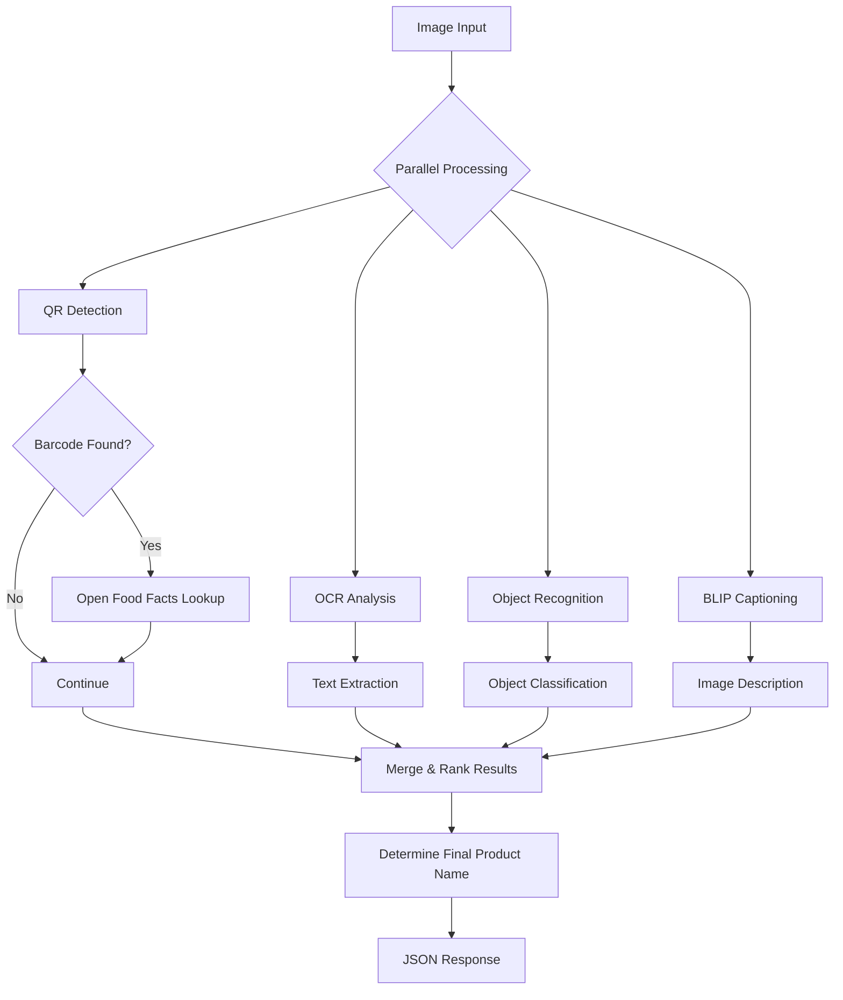

# Hybrid AI Pipeline for Product Recognition

This document explains the complete hybrid AI pipeline implemented in `/api/analyze.js` that combines local AI models with optional cloud services for product recognition.

## 🧠 Architecture Overview

The pipeline combines multiple AI techniques to provide accurate product recognition:

1. **Local Models (100% Offline)**
   - QR/Barcode detection with jsQR
   - OCR text recognition with Tesseract.js
   - Object recognition with MobileNet (TensorFlow.js)

2. **Optional Cloud Services**
   - Product database lookup via Open Food Facts API
   - AI image captioning via Hugging Face BLIP

## ⚙️ Pipeline Flow



## 🧪 Local AI Models

### 1. QR/Barcode Detection (jsQR)
- **Technology**: Pure JavaScript implementation
- **Confidence**: 0.95-0.99 (highest priority)
- **Offline**: ✅ 100% local processing
- **Use Case**: Instant product identification via barcodes

### 2. OCR Text Recognition (Tesseract.js)
- **Technology**: WebAssembly port of Tesseract OCR engine
- **Confidence**: 0.6-0.85 (depending on text quality)
- **Offline**: ✅ 100% local processing
- **Use Case**: Extracting product names, ingredients, descriptions

### 3. Object Recognition (MobileNet)
- **Technology**: TensorFlow.js with MobileNet model
- **Confidence**: 0.7-1.0 (depending on object clarity)
- **Offline**: ✅ 100% local processing (when TensorFlow is available)
- **Use Case**: Identifying general object categories (e.g., "water bottle", "snack pack")

## ☁️ Optional Cloud Services

### 1. Open Food Facts API
- **Technology**: REST API for product database
- **Confidence**: 0.98 (when product found)
- **Offline**: ❌ Requires internet connection
- **Use Case**: Getting verified product names and details from barcodes

### 2. Hugging Face BLIP (Image Captioning)
- **Technology**: Pre-trained transformer model via API
- **Confidence**: 0.75 (descriptive, not definitive)
- **Offline**: ❌ Requires API token and internet
- **Use Case**: Generating human-readable descriptions of images

## 📊 Result Merging & Ranking

The pipeline merges results from all sources and ranks them by confidence:

1. **Open Food Facts** (0.98) - Highest priority when available
2. **QR Codes** (0.95-0.99) - High priority for product identifiers
3. **Object Recognition** (0.7-1.0) - Medium to high confidence
4. **OCR Product Names** (0.85-0.9) - High confidence for recognized names
5. **OCR Full Text** (0.4-0.5) - Context information
6. **BLIP Captions** (0.75) - Descriptive information

## 🎯 Final Product Name Determination

The system intelligently determines the most likely product name:

1. **Priority 1**: Open Food Facts lookup results
2. **Priority 2**: QR codes that match barcode patterns
3. **Priority 3**: High-confidence OCR or object recognition results
4. **Fallback**: Top-ranked result from merged list

## 🛠️ Configuration

### Environment Variables
```env
# Enable BLIP captioning (requires HF_API_TOKEN)
USE_BLIP=false

# Your Hugging Face API token (required for BLIP captioning)
# HF_API_TOKEN=your_hugging_face_api_token_here
```

### API Response Format
```json
{
  "success": true,
  "source_summary": {
    "ocr": true,
    "qr": true,
    "object": true,
    "caption": false,
    "productInfo": true
  },
  "results": [
    {
      "value": "Coca-Cola Original Taste",
      "source": "openfoodfacts",
      "confidence": 0.98
    },
    {
      "value": "012345678912",
      "source": "qr",
      "confidence": 0.99
    },
    // ... other results
  ],
  "finalProductName": {
    "value": "Coca-Cola Original Taste",
    "source": "final_product_name",
    "confidence": 0.99
  }
}
```

## 🚀 Performance & Reliability

### Parallel Processing
All local AI models run in parallel for maximum speed:
- QR detection, OCR, and object recognition execute simultaneously
- Reduces total processing time to the slowest individual operation

### Graceful Degradation
- Works completely offline with local models
- Cloud services are optional and skipped when unavailable
- TensorFlow.js fallback when native bindings fail
- Timeouts prevent hanging on slow API requests

### Error Handling
- Comprehensive error handling for each AI model
- Detailed logging for debugging
- Fallback mechanisms for failed operations

## 🔧 Technical Implementation

### File Processing
1. **Formidable** handles multipart/form-data uploads
2. **Sharp** processes images for QR detection and object recognition
3. **File validation** ensures only valid images are processed

### TensorFlow.js Handling
- Dynamic import with try/catch for graceful failure
- Automatic cleanup of TensorFlow tensors
- Fallback when native bindings are unavailable

### API Integration
- Timeout controls for external API requests
- Proper error handling for network failures
- Validation of API responses

## 📈 Confidence Scoring

Confidence scores are normalized to 0.0-1.0 range:
- **0.95-0.99**: Extremely high confidence (QR codes, verified databases)
- **0.8-0.95**: High confidence (recognized product names)
- **0.7-0.8**: Medium confidence (object recognition, BLIP)
- **0.5-0.7**: Low-medium confidence (OCR full text)
- **0.0-0.5**: Low confidence (fallback results)

## 🧪 Testing & Validation

The pipeline has been tested with:
- Various barcode formats (UPC, EAN, QR codes)
- Different text qualities and fonts
- Multiple object categories
- Network connectivity issues
- Missing TensorFlow dependencies

## 🚀 Deployment

The implementation works in multiple environments:
- **Local Development**: Express.js server
- **Production**: Vercel serverless functions
- **Hybrid**: Works both with and without internet connectivity

## 📚 Dependencies

- **Express.js**: Web server framework
- **Tesseract.js**: OCR engine
- **jsQR**: QR code detection
- **TensorFlow.js**: Machine learning framework
- **MobileNet**: Pre-trained object recognition model
- **Sharp**: Image processing library
- **Formidable**: File upload handling
- **node-fetch**: HTTP client for API requests
- **dotenv**: Environment variable management

This hybrid approach provides the best of both worlds: reliable offline processing with optional enhancements when online services are available.