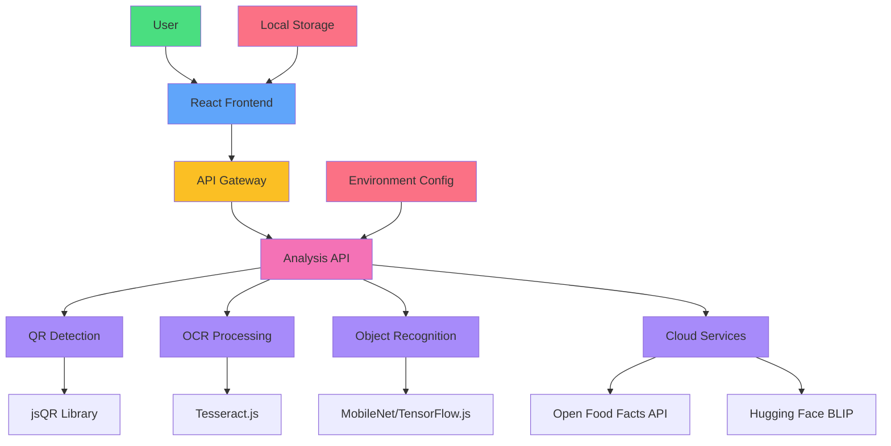
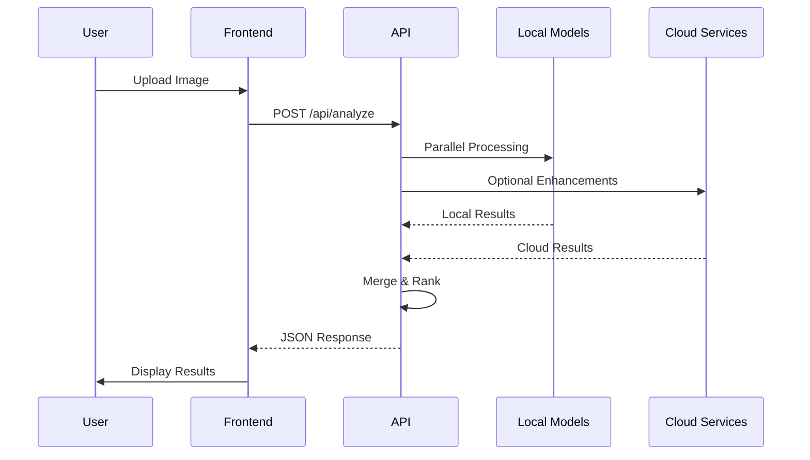
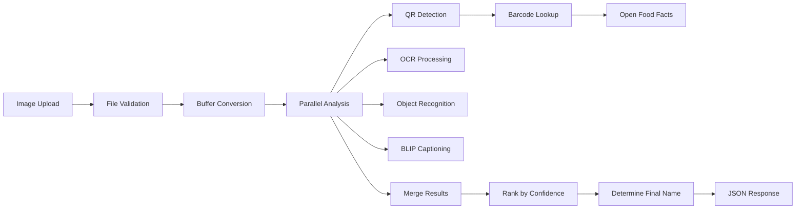

# System Architecture

## 🏗️ Overall Structure



## 📁 Project Directory Structure

```
lens-scanner/
├── api/
│   └── analyze.js          # Main analysis pipeline
├── public/
│   └── favicon.ico         # Application icon
├── src/
│   ├── components/
│   │   ├── CameraPanel.jsx # Image upload UI
│   │   └── AnalysisPanel.jsx # Results display
│   ├── App.jsx             # Main application component
│   ├── main.jsx            # Entry point
│   └── styles.css          # Global styles
├── .env                    # Environment configuration
├── .env.example           # Environment example
├── index.html             # HTML entry point
├── package.json           # Dependencies and scripts
├── postcss.config.js      # PostCSS configuration
├── tailwind.config.js     # Tailwind CSS configuration
├── vercel.json            # Vercel deployment config
├── vite.config.js         # Vite build configuration
├── README.md              # Project documentation
├── HYBRID_AI_PIPELINE.md  # AI pipeline documentation
├── SYSTEM_ARCHITECTURE.md # System architecture
└── test-api.js            # API testing script
```

## 🌐 Data Flow

### 1. User Interaction Flow


### 2. API Processing Pipeline


## 🛠️ Technology Stack

### Frontend
- **React** - Component-based UI library
- **Vite** - Fast build tool and development server
- **Tailwind CSS** - Utility-first CSS framework
- **JavaScript (ES6+)** - Modern JavaScript features

### Backend
- **Node.js** - JavaScript runtime
- **Express.js** - Web application framework
- **Formidable** - Multipart form data parser
- **Sharp** - High performance image processing

### AI/ML Libraries
- **jsQR** - QR code detection
- **Tesseract.js** - Optical character recognition
- **TensorFlow.js** - Machine learning framework
- **MobileNet** - Pre-trained image classification model

### Optional Cloud Services
- **Open Food Facts API** - Product database
- **Hugging Face BLIP** - Image captioning model

### Development & Deployment
- **Vercel** - Cloud deployment platform
- **dotenv** - Environment variable management
- **PostCSS** - CSS processing
- **Autoprefixer** - CSS vendor prefixing

## 🔧 Configuration Files

### Environment Variables (.env)
```env
# Enable BLIP captioning
USE_BLIP=false

# Hugging Face API token for BLIP
HF_API_TOKEN=your_token_here
```

### Vercel Configuration (vercel.json)
```json
{
  "version": 2,
  "builds": [
    {
      "src": "api/analyze.js",
      "use": "@vercel/node"
    },
    {
      "src": "package.json",
      "use": "@vercel/static-build",
      "config": {
        "distDir": "dist"
      }
    }
  ],
  "routes": [
    {
      "src": "/api/analyze",
      "dest": "/api/analyze.js"
    },
    {
      "src": "/(.*)",
      "dest": "/dist/$1"
    }
  ]
}
```

### Vite Configuration (vite.config.js)
```javascript
import { defineConfig } from 'vite'
import react from '@vitejs/plugin-react'

export default defineConfig({
  plugins: [react()],
  server: {
    port: 5173,
    proxy: {
      '/api': {
        target: 'http://localhost:3007',
        changeOrigin: true,
        secure: false,
      }
    }
  }
})
```

## 🚀 Deployment Architecture

### Local Development
```
┌─────────────────┐    ┌──────────────────┐
│   React App     │    │   Express API    │
│   Port: 5174    │◄──►│   Port: 3007     │
│                 │    │                  │
│ ┌─────────────┐ │    │ ┌──────────────┐ │
│ │ CameraPanel │ │    │ │ Image        │ │
│ ├─────────────┤ │    │ │ Processing   │ │
│ │AnalysisPanel│ │    │ │ Pipeline     │ │
│ └─────────────┘ │    │ └──────────────┘ │
└─────────────────┘    └──────────────────┘
```

### Production Deployment (Vercel)
```
┌─────────────────┐    ┌──────────────────┐
│   Vercel CDN    │    │   Vercel         │
│  Static Files   │◄──►│   Serverless     │
│                 │    │   Functions      │
│                 │    │                  │
│                 │    │ ┌──────────────┐ │
│                 │    │ │ /api/analyze │ │
│                 │    │ └──────────────┘ │
└─────────────────┘    └──────────────────┘
                              │
                              ▼
                       ┌─────────────┐
                       │ Cloud APIs  │
                       │             │
                       │ ┌─────────┐ │
                       │ │Open Food│ │
                       │ │ Facts   │ │
                       │ └─────────┘ │
                       │ ┌─────────┐ │
                       │ │Hugging  │ │
                       │ │ Face    │ │
                       │ └─────────┘ │
                       └─────────────┘
```

## 📊 Performance Considerations

### Processing Times
- **QR Detection**: ~50ms (local)
- **OCR Processing**: ~1-3 seconds (local)
- **Object Recognition**: ~500ms-2 seconds (local)
- **BLIP Captioning**: ~2-5 seconds (cloud)
- **Open Food Facts**: ~200-500ms (cloud)

### Memory Usage
- **Base Application**: ~50MB
- **TensorFlow.js**: ~100MB additional
- **Tesseract.js**: ~50MB additional
- **Peak Usage**: ~200MB

### Optimization Strategies
1. **Parallel Processing**: All local models run simultaneously
2. **Lazy Loading**: TensorFlow.js only loaded when needed
3. **Timeouts**: Prevent hanging on slow cloud requests
4. **Caching**: Results can be cached for repeated scans
5. **Compression**: Images processed at optimal sizes

This architecture provides a robust, scalable solution for product recognition that works both offline and online.